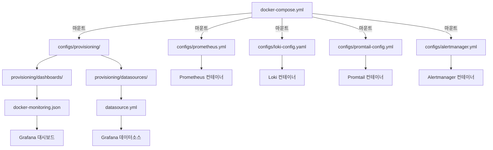

# 📁 grafana 저장소 디렉토리 구조 및 용도

## 🏗️ 저장소 개요

**저장소**: `github.com/qws941/grafana`
**목적**: Grafana 모니터링 스택 + n8n 워크플로우 자동화 통합 배포
**배포 방식**: Docker Compose + GitOps

---

## 📂 디렉토리 구조

```
grafana/
├── .serena/                      # Serena MCP 프로젝트 설정
├── compose/                      # 🐳 Docker Compose 배포 파일
├── configs/                      # ⚙️ 서비스 설정 파일
│   └── provisioning/             # 📦 Grafana 자동 프로비저닝
│       ├── dashboards/           # 📊 대시보드 정의
│       └── datasources/          # 🔌 데이터소스 설정
├── docs/                         # 📚 문서
├── scripts/                      # 🔧 유틸리티 스크립트
├── CLAUDE.md                     # 🤖 Claude AI 작업 이력
├── DEPLOYMENT_CHECK.md           # ✅ 배포 검증 가이드
└── README.md                     # 📖 저장소 소개
```

---

## 📋 디렉토리별 상세 용도

### 🐳 `compose/` - Docker Compose 배포 디렉토리

**용도**: Docker Compose를 사용한 전체 스택 배포 설정

| 파일 | 용도 | 설명 |
|------|------|------|
| `docker-compose.yml` | **메인 배포 파일** | 전체 모니터링 스택 + n8n 정의 (12개 서비스) |
| `.env` | 환경 변수 | 비밀번호, 도메인, 경로 등 설정 |

**포함된 서비스**:
```
모니터링 스택 (7개):
- grafana-container
- prometheus-container
- loki-container
- promtail-container
- alertmanager-container
- node-exporter-container
- cadvisor-container

n8n 워크플로우 자동화 (5개):
- n8n-container
- n8n-postgres-container
- n8n-redis-container
- n8n-postgres-exporter-container
- n8n-redis-exporter-container
```

**배포 명령어**:
```bash
cd compose/
docker-compose up -d
```

---

### ⚙️ `configs/` - 서비스 설정 파일 디렉토리

**용도**: 각 모니터링 서비스의 설정 파일 중앙 관리

| 파일 | 서비스 | 용도 |
|------|--------|------|
| `prometheus.yml` | Prometheus | 메트릭 스크랩 설정 (n8n 포함) |
| `prometheus-alerts.yml` | Prometheus | 알람 규칙 정의 |
| `loki-config.yaml` | Loki | 로그 저장 및 retention 설정 |
| `promtail-config.yml` | Promtail | Docker 로그 수집 설정 |
| `alertmanager.yml` | Alertmanager | 알람 라우팅 설정 |
| `grafana.ini` | Grafana | Grafana 서버 설정 |
| `sync-config.yaml` | Syncthing | 설정 파일 동기화 설정 (선택) |

**마운트 경로**: `${GRAFANA_CONFIG_PATH:-/volume1/docker/grafana}/configs/`

**특이사항**:
- 모든 설정 파일은 **read-only (`:ro`)** 마운트
- 환경 변수 `GRAFANA_CONFIG_PATH`로 경로 커스터마이징 가능
- `prometheus.yml`에 n8n 스크랩 설정 포함됨

---

### 📦 `configs/provisioning/` - Grafana 자동 프로비저닝

**용도**: Grafana 시작 시 자동으로 대시보드 및 데이터소스 설정

#### 📊 `provisioning/dashboards/`

| 파일 | 용도 |
|------|------|
| `dashboard.yml` | 대시보드 프로비저닝 설정 |
| `docker-monitoring.json` | Docker 모니터링 대시보드 정의 |
| `.gitkeep` | 빈 디렉토리 Git 추적용 |

**동작 방식**:
1. Grafana 컨테이너 시작
2. `dashboard.yml` 읽기
3. `docker-monitoring.json` 자동 import
4. 재시작 없이 대시보드 사용 가능

#### 🔌 `provisioning/datasources/`

| 파일 | 용도 |
|------|------|
| `datasource.yml` | Prometheus, Loki 데이터소스 자동 등록 |

**설정 예시**:
```yaml
datasources:
  - name: Prometheus
    type: prometheus
    url: http://prometheus:9090
  - name: Loki
    type: loki
    url: http://loki:3100
```

---

### 🔧 `scripts/` - 유틸리티 스크립트

**용도**: 백업, API 조작, 볼륨 구조 생성 등 자동화 스크립트

| 파일 | 용도 | 실행 방법 |
|------|------|-----------|
| `backup.sh` | Grafana 데이터 백업 | `./scripts/backup.sh` |
| `create-volume-structure.sh` | NFS 볼륨 디렉토리 생성 | `./scripts/create-volume-structure.sh` |
| `grafana-api.sh` | Grafana API 호출 래퍼 | `./scripts/grafana-api.sh <endpoint>` |

**사용 예시**:
```bash
# 1. 볼륨 구조 생성 (최초 배포 시)
./scripts/create-volume-structure.sh

# 2. Grafana 데이터 백업
./scripts/backup.sh

# 3. Grafana API로 대시보드 목록 조회
./scripts/grafana-api.sh /api/dashboards
```

---

### 📚 `docs/` - 문서 디렉토리

**용도**: 프로젝트 관련 문서 및 가이드 저장

| 파일 | 용도 |
|------|------|
| `README.md` | 문서 인덱스 및 개요 |

**향후 추가 가능한 문서**:
- 아키텍처 다이어그램
- 트러블슈팅 가이드
- 네트워크 구성도
- 보안 정책

---

### 🤖 `.serena/` - Serena MCP 프로젝트 설정

**용도**: Serena MCP (Model Context Protocol) 서버 프로젝트 메타데이터

| 파일 | 용도 |
|------|------|
| `project.yml` | Serena 프로젝트 정의 |
| `.gitignore` | Serena 임시 파일 제외 |

**설명**: Claude Code의 Serena MCP 서버가 코드 분석 및 리팩토링 시 사용하는 설정 파일

---

## 📄 루트 레벨 파일

| 파일 | 용도 |
|------|------|
| `README.md` | 저장소 소개 및 Quick Start |
| `CLAUDE.md` | Claude AI와의 작업 이력 및 의사결정 기록 |
| `DEPLOYMENT_CHECK.md` | 배포 후 검증 및 모니터링 확인 가이드 |
| `.gitignore` | Git 추적 제외 파일 목록 |

---

## 🔄 파일 흐름 및 관계



---

## 🎯 사용 시나리오별 파일 위치

### 시나리오 1: 새로운 서비스 메트릭 추가
1. **수정 파일**: `configs/prometheus.yml`
2. **추가 내용**:
   ```yaml
   - job_name: 'new-service'
     static_configs:
       - targets: ['new-service:9090']
   ```
3. **적용**: `curl -X POST http://prometheus.jclee.me/-/reload`

### 시나리오 2: Grafana 대시보드 추가
1. **파일 위치**: `configs/provisioning/dashboards/`
2. **파일 생성**: `new-dashboard.json`
3. **적용**: Grafana 자동 리로드 (30초)

### 시나리오 3: 로그 필터링 규칙 추가
1. **수정 파일**: `configs/promtail-config.yml`
2. **섹션**: `pipeline_stages`
3. **적용**: `docker-compose restart promtail`

### 시나리오 4: 알람 규칙 추가
1. **수정 파일**: `configs/prometheus-alerts.yml`
2. **적용**: `curl -X POST http://prometheus.jclee.me/-/reload`

---

## 📊 디렉토리별 우선순위

| 우선순위 | 디렉토리 | 수정 빈도 | 중요도 |
|---------|---------|----------|--------|
| 🔴 높음 | `compose/` | 낮음 | 매우 높음 |
| 🟠 높음 | `configs/` | 중간 | 높음 |
| 🟡 중간 | `scripts/` | 낮음 | 중간 |
| 🟢 낮음 | `docs/` | 중간 | 중간 |
| 🔵 낮음 | `.serena/` | 매우 낮음 | 낮음 |

---

## 🚨 주의사항

### ⚠️ 절대 수정하면 안 되는 것
1. `compose/.env` → 비밀번호 포함, Git에 커밋 금지
2. `configs/provisioning/dashboards/.gitkeep` → 삭제 시 빈 디렉토리 추적 불가
3. `.serena/.gitignore` → Serena MCP 작동에 필요

### ✅ 안전하게 수정 가능
1. `configs/*.yml` → 서비스 설정 (리로드로 적용)
2. `configs/provisioning/dashboards/*.json` → 대시보드 추가
3. `scripts/*.sh` → 스크립트 개선

### 🔄 수정 후 재시작 필요
1. `docker-compose.yml` → `docker-compose up -d` 재시작
2. `configs/loki-config.yaml` → `docker-compose restart loki`
3. `configs/promtail-config.yml` → `docker-compose restart promtail`

---

## 🎯 Best Practices

### 1. Config 파일 수정 시
```bash
# 1. 백업
cp configs/prometheus.yml configs/prometheus.yml.backup

# 2. 수정
vim configs/prometheus.yml

# 3. 검증 (YAML 문법 체크)
yamllint configs/prometheus.yml

# 4. 적용
curl -X POST http://prometheus.jclee.me/-/reload
```

### 2. 새로운 대시보드 추가 시
```bash
# 1. Grafana UI에서 대시보드 생성
# 2. Share → Export → Save to file
# 3. 파일을 provisioning/dashboards/로 복사
cp ~/Downloads/dashboard.json configs/provisioning/dashboards/my-dashboard.json

# 4. Git 커밋
git add configs/provisioning/dashboards/my-dashboard.json
git commit -m "feat: Add my custom dashboard"
```

### 3. 스크립트 추가 시
```bash
# 1. 실행 권한 부여
chmod +x scripts/my-script.sh

# 2. 테스트
./scripts/my-script.sh --dry-run

# 3. Git 커밋
git add scripts/my-script.sh
git commit -m "feat: Add utility script for XYZ"
```

---

## 📚 참고 문서

- **배포 가이드**: `README.md`
- **배포 검증**: `DEPLOYMENT_CHECK.md`
- **작업 이력**: `CLAUDE.md`
- **공식 문서**:
  - Prometheus: https://prometheus.io/docs/
  - Grafana: https://grafana.com/docs/
  - Loki: https://grafana.com/docs/loki/
  - n8n: https://docs.n8n.io/

---

**업데이트**: 2025-10-09
**버전**: 1.0
**관리자**: Claude Code AI
