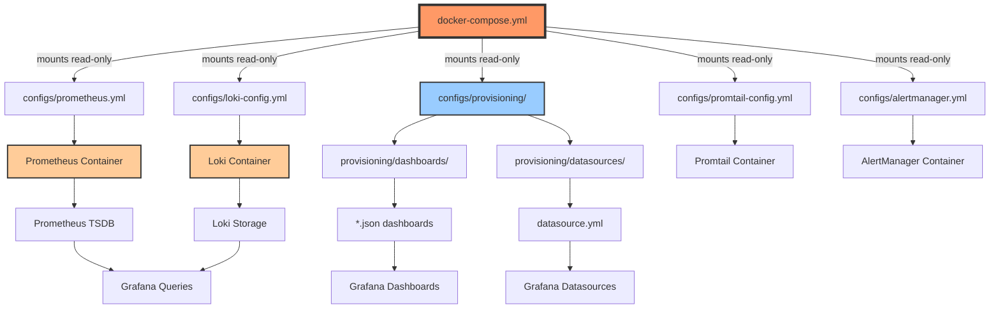

# 📁 Grafana Repository - Directory Structure and Usage Guide

Comprehensive guide to the directory structure, file organization, and usage patterns for the Grafana Monitoring Stack repository.

---

## 🏗️ Repository Overview

**Repository**: `github.com/qws941/grafana`
**Purpose**: Integrated Grafana monitoring stack + n8n workflow automation deployment
**Deployment Method**: Docker Compose + GitOps
**Deployment Target**: Synology NAS (192.168.50.215:1111)
**Development**: Rocky Linux 9 (192.168.50.100) with real-time sync

---

## 📂 Directory Structure

```
grafana/
├── .github/                       # 🔄 GitHub Actions CI/CD
│   └── workflows/                 # Automated validation workflows
│       └── validate.yml           # 7-job validation pipeline
├── .serena/                       # 🤖 Serena MCP project configuration
│   ├── project.yml                # Serena project definition
│   └── .gitignore                 # Serena temporary files
├── configs/                       # ⚙️ Service configuration files
│   ├── prometheus.yml             # Prometheus scrape configuration (12+ targets)
│   ├── alert-rules.yml            # Alert rules (20+ rules)
│   ├── recording-rules.yml        # Recording rules (32 rules)
│   ├── loki-config.yml            # Loki log storage configuration
│   ├── promtail-config.yml        # Promtail log collection configuration
│   ├── alertmanager.yml           # AlertManager routing configuration
│   └── provisioning/              # 📦 Grafana auto-provisioning
│       ├── dashboards/            # 📊 Dashboard definitions (5 core dashboards)
│       │   ├── dashboard.yml      # Dashboard provisioning config
│       │   ├── monitoring-stack-health.json
│       │   ├── system-metrics.json
│       │   ├── container-performance.json
│       │   ├── n8n-workflow-automation-reds.json
│       │   └── log-analysis.json
│       └── datasources/           # 🔌 Datasource configurations
│           └── datasource.yml     # Prometheus, Loki, AlertManager
├── demo/                          # 🎬 Demonstration materials
│   ├── README.md                  # Demo guide (577 lines)
│   ├── examples/                  # Configuration examples
│   │   ├── sample-dashboard.json
│   │   ├── sample-alert-rule.yml
│   │   ├── sample-recording-rule.yml
│   │   └── sample-promtail-config.yml
│   ├── screenshots/               # Visual documentation (18 screenshots)
│   │   └── README.md
│   └── videos/                    # Walkthrough videos (6 videos)
│       └── README.md
├── docs/                          # 📚 Documentation
│   ├── DEPLOYMENT_CHECK.md        # Deployment verification guide (692 lines)
│   ├── DIRECTORY_STRUCTURE.md     # This file
│   ├── DEDUPLICATION-OPTIMIZATION-2025-10.md
│   ├── HYCU-DASHBOARD-IMPLEMENTATION.md
│   └── archive/                   # Archived documentation
│       └── 2025-10/               # October 2025 archives
├── resume/                        # 📖 Project resume (mandatory)
│   ├── README.md                  # Project overview (533 lines)
│   ├── architecture.md            # System architecture (700+ lines)
│   ├── api.md                     # API reference (600+ lines)
│   ├── deployment.md              # Deployment guide (500+ lines)
│   └── troubleshooting.md         # Troubleshooting guide (600+ lines)
├── scripts/                       # 🔧 Utility scripts
│   ├── health-check.sh            # Service health validation
│   ├── validate-metrics.sh        # Metrics existence validation
│   ├── realtime-sync.sh           # Manual sync trigger
│   ├── grafana-api.sh             # Grafana API wrapper
│   ├── create-volume-structure.sh # NAS volume directory creation
│   └── lib/                       # Common libraries
│       └── common.sh              # Shared functions
├── .env.example                   # Environment variables template
├── .env.credentials.example       # API credentials template
├── docker-compose.yml             # Main deployment file (12 services)
├── CLAUDE.md                      # Project-specific guidance for Claude Code
└── README.md                      # Project introduction (457 lines)
```

---

## 📋 Directory Details and Usage

### 🐳 Root Level - Docker Compose Deployment

**Purpose**: Main deployment configuration for the entire monitoring stack

| File | Purpose | Description |
|------|---------|-------------|
| `docker-compose.yml` | **Main deployment file** | Defines all 12 services (monitoring + n8n) |
| `.env.example` | Environment variables template | Template with pinned versions (committed to git) |
| `.env` | Environment variables (gitignored) | Actual values with secrets (NEVER commit) |

**Services Defined (12 containers)**:

**Monitoring Stack (7 services)**:
```yaml
1. grafana-container          # Port 3000 → grafana.jclee.me
2. prometheus-container       # Port 9090 → prometheus.jclee.me
3. loki-container             # Port 3100 → loki.jclee.me
4. promtail-container         # Log forwarder (no external port)
5. alertmanager-container     # Port 9093 → alertmanager.jclee.me
6. node-exporter-container    # Port 9100 (system metrics)
7. cadvisor-container         # Port 8080 (container metrics)
```

**n8n Workflow Automation Stack (5 services)**:
```yaml
8. n8n-container                      # Port 5678 → n8n.jclee.me
9. n8n-postgres-container             # Port 5432 (n8n database)
10. n8n-redis-container               # Port 6379 (n8n queue)
11. n8n-postgres-exporter-container   # Port 9187 (DB metrics)
12. n8n-redis-exporter-container      # Port 9121 (cache metrics)
```

**Deployment Commands**:
```bash
# Deploy stack (on Synology NAS)
ssh -p 1111 jclee@192.168.50.215
cd /volume1/grafana
sudo docker-compose up -d

# Check status
sudo docker ps --format "table {{.Names}}\t{{.Status}}\t{{.Ports}}"

# View logs
sudo docker logs -f grafana-container
```

---

### ⚙️ `configs/` - Service Configuration Files

**Purpose**: Central configuration management for all monitoring services

**Key Configuration Files**:

| File | Service | Purpose | Hot Reload |
|------|---------|---------|------------|
| `prometheus.yml` | Prometheus | Metrics scrape config (12+ targets) | ✅ Yes (`curl -X POST /-/reload`) |
| `alert-rules.yml` | Prometheus | Alert rules (20+ rules, 4 groups) | ✅ Yes (via reload) |
| `recording-rules.yml` | Prometheus | Recording rules (32 rules, 7 groups) | ✅ Yes (via reload) |
| `loki-config.yml` | Loki | Log storage, 3-day retention | ❌ No (restart required) |
| `promtail-config.yml` | Promtail | Docker log collection, auto-discovery | ❌ No (restart required) |
| `alertmanager.yml` | AlertManager | Alert routing and webhooks | ✅ Yes (via reload) |

**Mount Path on Synology NAS**: `/volume1/grafana/configs/`

**Important Notes**:
- All config files mounted **read-only (`:ro`)**
- Synced in real-time via `grafana-sync.service` (1-2s latency)
- `prometheus.yml` includes all n8n scrape targets
- Always validate metrics exist before adding to dashboards

**Example: Adding New Scrape Target**:
```yaml
# Edit configs/prometheus.yml
scrape_configs:
  - job_name: 'my-service'
    static_configs:
      - targets: ['my-service-container:9090']
    scrape_interval: 15s
    scrape_timeout: 10s

# Apply (hot reload, no restart)
ssh -p 1111 jclee@192.168.50.215 \
  "sudo docker exec prometheus-container wget --post-data='' -qO- http://localhost:9090/-/reload"

# Verify
curl -s https://prometheus.jclee.me/api/v1/targets | jq '.data.activeTargets[] | select(.labels.job=="my-service")'
```

---

### 📦 `configs/provisioning/` - Grafana Auto-Provisioning

**Purpose**: Grafana automatically loads dashboards and datasources on startup

#### 📊 `provisioning/dashboards/`

**Auto-provisioning cycle**: Every 10 seconds

| File | Purpose | Panels | Methodology |
|------|---------|--------|-------------|
| `dashboard.yml` | Provisioning configuration | - | - |
| `monitoring-stack-health.json` | Self-monitoring dashboard | 8 | USE |
| `system-metrics.json` | Infrastructure monitoring | 12 | USE |
| `container-performance.json` | Docker metrics | 10 | USE |
| `n8n-workflow-automation-reds.json` | n8n application monitoring | 15 | REDS |
| `log-analysis.json` | Log aggregation dashboard | 6 | - |

**How Auto-Provisioning Works**:
1. Grafana container starts
2. Reads `dashboard.yml` configuration
3. Scans `*.json` files in directory
4. Auto-imports all dashboards
5. **Refreshes every 10 seconds** (updates existing dashboards)
6. No restart required

**Important**:
- **Do NOT create dashboards manually in UI** - they will be overwritten
- All dashboard edits must be done in JSON files
- Use validated metrics only (see `scripts/validate-metrics.sh`)
- Follow REDS (application) or USE (infrastructure) methodology

#### 🔌 `provisioning/datasources/`

**File**: `datasource.yml`

**Auto-configured Datasources**:
```yaml
datasources:
  - name: Prometheus
    type: prometheus
    uid: prometheus              # Used in dashboard JSON
    url: http://prometheus-container:9090
    access: proxy
    isDefault: true

  - name: Loki
    type: loki
    uid: loki                    # Used in dashboard JSON
    url: http://loki-container:3100
    access: proxy

  - name: AlertManager
    type: alertmanager
    uid: P4AAF3E0C04587B6C        # Used in alert rules
    url: http://alertmanager-container:9093
    access: proxy
```

**Critical**: Dashboard panels must use correct datasource UIDs (`"uid": "prometheus"` or `"uid": "loki"`)

---

### 🎬 `demo/` - Demonstration Materials

**Purpose**: Examples, screenshots, and visual materials for documentation

**Structure**:
- `README.md` - Complete demo guide (577 lines)
- `examples/` - Sample configuration files
  - `sample-dashboard.json` - REDS methodology template
  - `sample-alert-rule.yml` - Alert rule examples
  - `sample-recording-rule.yml` - Recording rule examples
  - `sample-promtail-config.yml` - Log collection config
- `screenshots/` - Visual documentation (18 required screenshots)
- `videos/` - Walkthrough videos (6 required videos)

**Usage**:
```bash
# Copy example as starting point
cp demo/examples/sample-dashboard.json configs/provisioning/dashboards/my-dashboard.json

# Edit for your service
vim configs/provisioning/dashboards/my-dashboard.json

# Validate metrics exist
./scripts/validate-metrics.sh -d configs/provisioning/dashboards/my-dashboard.json

# Wait for auto-provisioning (11-12 seconds)
# 1-2s sync + 10s Grafana scan = 11-12s total
```

---

### 📚 `docs/` - Documentation Directory

**Purpose**: Technical documentation, guides, and archived reports

**Active Documentation**:
- `DEPLOYMENT_CHECK.md` - Deployment verification guide (692 lines)
- `DIRECTORY_STRUCTURE.md` - This file (directory structure guide)
- `DEDUPLICATION-OPTIMIZATION-2025-10.md` - Deduplication optimization
- `HYCU-DASHBOARD-IMPLEMENTATION.md` - HYCU dashboard implementation

**Archive**:
- `archive/2025-10/` - October 2025 archived reports

**Future Documentation** (recommended):
- Network topology diagram
- Security policy documentation
- Performance tuning guide
- Disaster recovery procedures

---

### 📖 `resume/` - Project Resume (MANDATORY)

**Purpose**: Technical resume and comprehensive project documentation

**Constitutional Framework Requirement**: All projects MUST have `/resume/` directory

**Documentation Files**:

| File | Purpose | Lines | Status |
|------|---------|-------|--------|
| `README.md` | Project overview and index | 533 | ✅ Complete |
| `architecture.md` | System architecture, data flows | 700+ | ✅ Complete |
| `api.md` | Complete API reference | 600+ | ✅ Complete |
| `deployment.md` | Deployment procedures | 500+ | ✅ Complete |
| `troubleshooting.md` | Troubleshooting guide | 600+ | ✅ Complete |

**Total**: 2,400+ lines of technical documentation

**Usage**:
- Project overview: `resume/README.md`
- Architecture questions: `resume/architecture.md`
- API integration: `resume/api.md`
- Deployment help: `resume/deployment.md`
- Troubleshooting: `resume/troubleshooting.md`

---

### 🔧 `scripts/` - Utility Scripts

**Purpose**: Operational automation, health checks, and API operations

| Script | Purpose | Usage |
|--------|---------|-------|
| `health-check.sh` | Validate all service health | `./scripts/health-check.sh` |
| `validate-metrics.sh` | Verify metrics exist (MANDATORY) | `./scripts/validate-metrics.sh -d dashboard.json` |
| `realtime-sync.sh` | Manual sync trigger (if service down) | `./scripts/realtime-sync.sh` |
| `grafana-api.sh` | Grafana API wrapper | `./scripts/grafana-api.sh datasources` |
| `create-volume-structure.sh` | NAS volume creation (first deploy) | `./scripts/create-volume-structure.sh` |
| `lib/common.sh` | Shared functions library | `source scripts/lib/common.sh` |

**Common Usage Patterns**:

```bash
# 1. First-time deployment - Create volume structure on NAS
ssh -p 1111 jclee@192.168.50.215
cd /volume1/grafana/scripts
./create-volume-structure.sh

# 2. Health check after deployment
./scripts/health-check.sh
# Expected: All services return ✅

# 3. Validate metrics before dashboard deployment (CRITICAL)
./scripts/validate-metrics.sh -d configs/provisioning/dashboards/my-dashboard.json
# Expected: All metrics found in Prometheus

# 4. Manual sync trigger (only if grafana-sync.service is down)
./scripts/realtime-sync.sh
# Expected: Files synced to Synology NAS

# 5. Query Grafana API
./scripts/grafana-api.sh dashboards
# Expected: JSON list of all dashboards
```

---

### 🤖 `.serena/` - Serena MCP Project Configuration

**Purpose**: Serena MCP (Model Context Protocol) server project metadata

| File | Purpose |
|------|---------|
| `project.yml` | Serena project definition (language, paths) |
| `.gitignore` | Serena temporary files exclusion |

**Description**: Claude Code's Serena MCP server uses these files for code analysis, symbol search, and refactoring operations.

---

### 🔄 `.github/` - CI/CD Workflows

**Purpose**: Automated validation via GitHub Actions

**Workflow**: `.github/workflows/validate.yml` (218 lines, 7 jobs)

**Validation Jobs**:
1. `validate-yaml` - YAML syntax + duplicate keys
2. `validate-json` - Dashboard JSON validation
3. `validate-docker-compose` - Docker Compose config
4. `validate-scripts` - Shellcheck + permissions
5. `security-scan` - Hardcoded secrets detection
6. `documentation-check` - Required files presence
7. `summary` - Aggregate results

**Triggers**:
- Push to main/master/develop
- Pull requests to main/master
- Manual dispatch

**Usage**: Automatic - runs on every push/PR, no manual intervention required

---

## 🔄 File Flow and Relationships



**Key Relationships**:
1. `docker-compose.yml` mounts all config files (read-only)
2. Grafana auto-provisions dashboards every 10 seconds
3. Prometheus hot-reloads config changes (no restart)
4. Loki/Promtail require restart for config changes
5. Real-time sync keeps local and NAS in sync (1-2s)

---

## 🎯 Usage Scenarios by File Location

### Scenario 1: Add New Service Metrics to Prometheus

**Steps**:
1. **Edit**: `configs/prometheus.yml`
   ```yaml
   scrape_configs:
     - job_name: 'new-service'
       static_configs:
         - targets: ['new-service-container:9090']
   ```
2. **Sync**: Wait 1-2 seconds (automatic via grafana-sync.service)
3. **Apply**: Hot reload Prometheus
   ```bash
   ssh -p 1111 jclee@192.168.50.215 \
     "sudo docker exec prometheus-container wget --post-data='' -qO- http://localhost:9090/-/reload"
   ```
4. **Verify**: https://prometheus.jclee.me/targets → Check new-service is UP

### Scenario 2: Create New Grafana Dashboard

**Steps**:
1. **Validate metrics exist** (CRITICAL):
   ```bash
   ./scripts/validate-metrics.sh --list | grep service_metric
   ```
2. **Create**: `configs/provisioning/dashboards/my-dashboard.json`
   ```json
   {
     "uid": "my-dashboard",
     "title": "My Service Dashboard",
     "panels": [
       {
         "datasource": {"type": "prometheus", "uid": "prometheus"},
         "targets": [{"expr": "validated_metric_name"}]
       }
     ]
   }
   ```
3. **Sync**: Wait 1-2 seconds (automatic)
4. **Load**: Wait 10 seconds (Grafana auto-provision cycle)
5. **Verify**: https://grafana.jclee.me/d/my-dashboard

**Total latency**: 11-12 seconds (1-2s sync + 10s auto-provision)

### Scenario 3: Add Log Filtering Rule to Promtail

**Steps**:
1. **Edit**: `configs/promtail-config.yml`
   ```yaml
   pipeline_stages:
     - match:
         selector: '{job="my-service"} |= "error"'
         action: drop
   ```
2. **Sync**: Wait 1-2 seconds
3. **Apply**: Restart Promtail (requires restart, no hot reload)
   ```bash
   ssh -p 1111 jclee@192.168.50.215 "sudo docker restart promtail-container"
   ```
4. **Verify**: Check Promtail logs
   ```bash
   ssh -p 1111 jclee@192.168.50.215 "sudo docker logs promtail-container --tail 50"
   ```

### Scenario 4: Add Alert Rule

**Steps**:
1. **Edit**: `configs/alert-rules.yml`
   ```yaml
   groups:
     - name: my_alerts
       rules:
         - alert: HighErrorRate
           expr: rate(errors_total[5m]) > 0.1
           for: 5m
           labels:
             severity: warning
           annotations:
             summary: "High error rate detected"
   ```
2. **Sync**: Wait 1-2 seconds
3. **Apply**: Hot reload Prometheus
   ```bash
   ssh -p 1111 jclee@192.168.50.215 \
     "sudo docker exec prometheus-container wget --post-data='' -qO- http://localhost:9090/-/reload"
   ```
4. **Verify**: https://prometheus.jclee.me/rules

### Scenario 5: Update Environment Variables

**Steps**:
1. **Edit**: `.env` (on Synology NAS, NOT committed to git)
   ```bash
   ssh -p 1111 jclee@192.168.50.215
   vim /volume1/grafana/.env
   ```
2. **Apply**: Restart affected services
   ```bash
   sudo docker-compose up -d  # Recreates containers with new env
   ```
3. **Verify**: Check environment variables in container
   ```bash
   sudo docker exec grafana-container env | grep GRAFANA
   ```

---

## 📊 Directory Priority Matrix

| Priority | Directory | Modification Frequency | Importance | Risk Level |
|----------|-----------|------------------------|------------|------------|
| 🔴 Critical | `configs/` | Medium | Very High | High |
| 🔴 Critical | Root (`docker-compose.yml`, `.env`) | Low | Very High | Very High |
| 🟠 High | `configs/provisioning/` | Medium | High | Medium |
| 🟠 High | `scripts/` | Low | High | Low |
| 🟡 Medium | `resume/` | Medium | High | Low |
| 🟡 Medium | `demo/` | Low | Medium | Low |
| 🟢 Low | `docs/` | Medium | Medium | Low |
| 🔵 Very Low | `.serena/` | Very Low | Low | Low |
| 🔵 Very Low | `.github/` | Very Low | Medium | Low |

**Risk Level Explanation**:
- **Very High**: Incorrect changes cause entire stack failure
- **High**: Service-specific failures or data loss
- **Medium**: Configuration errors, requires restart
- **Low**: Documentation only, no service impact

---

## 🚨 Critical Guidelines

### ⚠️ NEVER Modify (Will Break System)

1. **`.env` in git** - Contains secrets, MUST be gitignored
   ```bash
   # Check it's gitignored
   git check-ignore .env
   # Expected: .env
   ```

2. **Container names in config files** - Must use full names
   ```yaml
   # ❌ WRONG
   url: http://prometheus:9090

   # ✅ CORRECT
   url: http://prometheus-container:9090
   ```

3. **Datasource UIDs in dashboards** - Must match `datasource.yml`
   ```json
   // ❌ WRONG
   "datasource": {"type": "prometheus", "uid": "wrong-uid"}

   // ✅ CORRECT
   "datasource": {"type": "prometheus", "uid": "prometheus"}
   ```

4. **`.gitkeep` files** - Required for empty directories in git
   ```bash
   # Don't delete these
   configs/provisioning/dashboards/.gitkeep
   ```

### ✅ Safe to Modify (With Proper Testing)

1. **Service configurations** (`configs/*.yml`)
   - Always backup first
   - Validate YAML syntax before applying
   - Test in development first

2. **Dashboards** (`configs/provisioning/dashboards/*.json`)
   - Validate metrics exist first (MANDATORY)
   - Follow REDS/USE methodology
   - Test queries in Prometheus before adding to dashboard

3. **Scripts** (`scripts/*.sh`)
   - Test with `--dry-run` flag if available
   - Verify with shellcheck
   - Test on non-production first

4. **Documentation** (`docs/`, `resume/`)
   - Keep in English only (Constitutional Framework requirement)
   - Maintain comprehensive detail
   - Update when architecture changes

### 🔄 Requires Restart After Modification

**No Restart Needed (Hot Reload)**:
- ✅ Prometheus config (`prometheus.yml`, alert rules, recording rules)
- ✅ Grafana dashboards (auto-provision every 10s)
- ✅ AlertManager config (`alertmanager.yml`)

**Restart Required**:
- ❌ Loki config (`loki-config.yml`) → `docker restart loki-container`
- ❌ Promtail config (`promtail-config.yml`) → `docker restart promtail-container`
- ❌ Docker Compose changes → `docker-compose up -d`
- ❌ Environment variables → `docker-compose up -d`

---

## 🎯 Best Practices

### 1. Configuration File Editing Workflow

```bash
# Step 1: Backup original
cp configs/prometheus.yml configs/prometheus.yml.backup

# Step 2: Edit locally (auto-synced to NAS within 1-2s)
vim configs/prometheus.yml

# Step 3: Validate syntax
yamllint configs/prometheus.yml

# Step 4: Check sync completed
sudo journalctl -u grafana-sync -n 5

# Step 5: Apply changes (hot reload for Prometheus)
ssh -p 1111 jclee@192.168.50.215 \
  "sudo docker exec prometheus-container wget --post-data='' -qO- http://localhost:9090/-/reload"

# Step 6: Verify (check Prometheus targets)
curl -s https://prometheus.jclee.me/api/v1/targets | \
  jq '.data.activeTargets[] | {job: .labels.job, health: .health}'

# Step 7: Commit to git (if successful)
git add configs/prometheus.yml
git commit -m "feat: Add my-service scrape target"
```

### 2. Dashboard Creation Workflow

```bash
# Step 1: Validate metrics exist (MANDATORY)
./scripts/validate-metrics.sh --list | grep my_metric

# If metric doesn't exist, STOP - add scrape target first
# Never create dashboards with non-existent metrics

# Step 2: Use sample template as starting point
cp demo/examples/sample-dashboard.json \
   configs/provisioning/dashboards/my-dashboard.json

# Step 3: Edit dashboard JSON
vim configs/provisioning/dashboards/my-dashboard.json
# - Update UID
# - Update title
# - Update panel queries with validated metrics
# - Use correct datasource UID: "prometheus" or "loki"

# Step 4: Validate metrics in dashboard
./scripts/validate-metrics.sh -d configs/provisioning/dashboards/my-dashboard.json

# Step 5: Wait for auto-provisioning (11-12 seconds)
# 1-2s sync + 10s Grafana scan = 11-12s total

# Step 6: Verify dashboard loaded
curl -s -u admin:bingogo1 \
  "https://grafana.jclee.me/api/dashboards/uid/my-dashboard" | \
  jq '.dashboard.title'

# Step 7: Check in browser
# https://grafana.jclee.me/d/my-dashboard

# Step 8: Commit to git
git add configs/provisioning/dashboards/my-dashboard.json
git commit -m "feat: Add my-service dashboard (REDS methodology)"
```

### 3. Script Development Workflow

```bash
# Step 1: Create script with proper shebang
cat > scripts/my-script.sh <<'EOF'
#!/bin/bash
set -euo pipefail

# Load common libraries
source "$(dirname "$0")/lib/common.sh"

# Your script logic here
EOF

# Step 2: Make executable
chmod +x scripts/my-script.sh

# Step 3: Validate with shellcheck
shellcheck scripts/my-script.sh

# Step 4: Test with dry-run (if applicable)
./scripts/my-script.sh --dry-run

# Step 5: Test in development
./scripts/my-script.sh

# Step 6: Commit to git
git add scripts/my-script.sh
git commit -m "feat: Add utility script for XYZ operation"
```

### 4. Environment Variable Management

```bash
# Step 1: Update .env.example (template, committed to git)
# Add new variables with placeholder values
cat >> .env.example <<EOF
# New service configuration
NEW_SERVICE_URL=https://example.com
NEW_SERVICE_API_KEY=changeme
EOF

# Step 2: Update actual .env on Synology NAS (NOT committed)
ssh -p 1111 jclee@192.168.50.215
vim /volume1/grafana/.env
# Add actual secret values

# Step 3: Restart services to pick up new variables
sudo docker-compose up -d

# Step 4: Verify environment variable in container
sudo docker exec grafana-container env | grep NEW_SERVICE

# Step 5: Commit only the .env.example (not .env!)
git add .env.example
git commit -m "feat: Add NEW_SERVICE configuration variables"
```

---

## 📚 Reference Documentation

**Internal Documentation**:
- [Main README](../README.md) - Project overview and quick start (457 lines)
- [Project Resume](../resume/README.md) - Technical resume and index (533 lines)
- [Architecture Guide](../resume/architecture.md) - System architecture (700+ lines)
- [API Reference](../resume/api.md) - Complete API documentation (600+ lines)
- [Deployment Guide](../resume/deployment.md) - Deployment procedures (500+ lines)
- [Troubleshooting Guide](../resume/troubleshooting.md) - Common issues (600+ lines)
- [Deployment Verification](./DEPLOYMENT_CHECK.md) - Post-deployment checks (692 lines)
- [Demo Guide](../demo/README.md) - Examples and scenarios (577 lines)
- [Project Guidance](../CLAUDE.md) - Claude Code project-specific guidance

**External Documentation**:
- **Prometheus**: https://prometheus.io/docs/
- **Grafana**: https://grafana.com/docs/
- **Loki**: https://grafana.com/docs/loki/
- **Promtail**: https://grafana.com/docs/loki/latest/clients/promtail/
- **AlertManager**: https://prometheus.io/docs/alerting/latest/alertmanager/
- **n8n**: https://docs.n8n.io/
- **Docker Compose**: https://docs.docker.com/compose/

---

**Last Updated**: 2025-10-17
**Version**: 2.0
**Status**: Active, Production
**Compliance**: Constitutional Framework v11.11 (English-only documentation)
